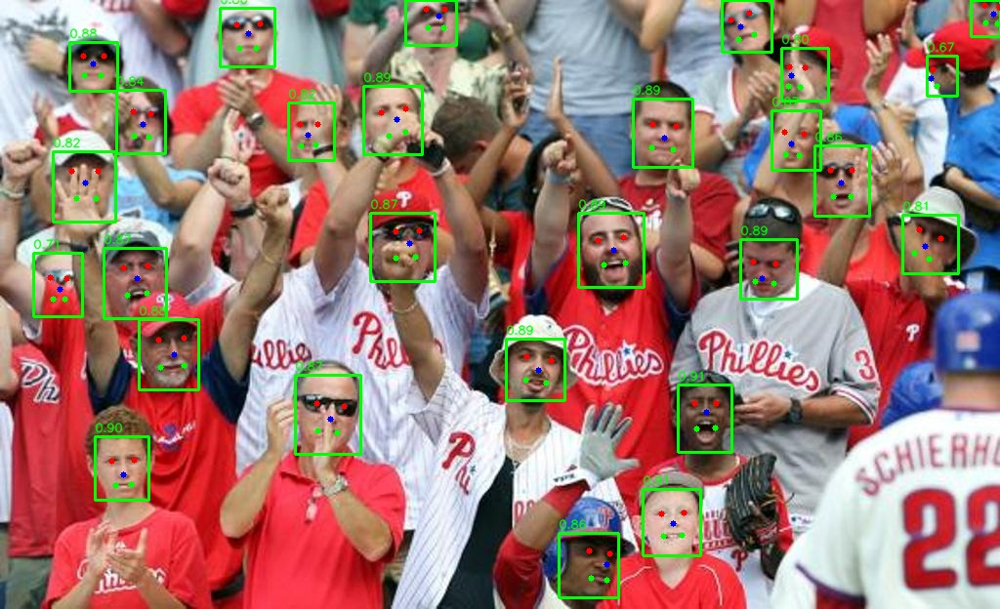

# YOLOv5-Face ONNX Inference

[](https://github.com/yakhyo/yolov5-face-onnx-inference)
[](https://github.com/yakhyo/yolov5-face-onnx-inference/blob/main/LICENSE)
[](https://github.com/yakhyo/yolov5-face-onnx-inference/stargazers)

Face detection with 5 facial landmarks using YOLOv5-Face ONNX Runtime inference.

Models converted to ONNX format from the original [YOLOv5-Face](https://github.com/deepcam-cn/yolov5-face) PyTorch implementation.

<p align="center">
  
</p>

## Features

- ONNX Runtime GPU (CUDA) inference
- TorchVision NMS for real-time performance
- 5 facial landmarks: eyes, nose, mouth corners
- Support for image, video, and webcam

## Installation

### Clone the Repository

```bash
git clone https://github.com/yakhyo/yolov5-face-onnx-inference.git
cd yolov5-face-onnx-inference
```

### Install Required Packages

```bash
pip install -r requirements.txt
```

**Note:** Requires CUDA for GPU acceleration. For CPU-only, replace `onnxruntime-gpu` with `onnxruntime` in `requirements.txt`.

## Weights

### Download Models

```bash
bash download.sh yolov5s_face  # Small model
bash download.sh yolov5m_face  # Medium model
```

### Model Performance

| Model Name | Easy  | Medium | Hard  | FLOPs (G) | Params (M) | Model Size |
| ---------- | ----- | ------ | ----- | --------- | ---------- | ---------- |
| YOLOv5s    | 94.33 | 92.61  | 83.15 | 5.751     | 7.075      | ~28 MB     |
| YOLOv5m    | 95.30 | 93.76  | 85.28 | 18.146    | 21.063     | ~84 MB     |

- **Easy/Medium/Hard**: mAP on WIDERFace validation subsets
- **YOLOv5s**: Recommended for real-time and resource-constrained applications
- **YOLOv5m**: Recommended for higher accuracy requirements

## Usage

```bash
# Webcam (display auto-enabled)
python main.py --weights weights/yolov5s_face.onnx --source 0

# Image
python main.py --weights weights/yolov5s_face.onnx --source image.jpg --save-img --view-img

# Video
python main.py --weights weights/yolov5m_face.onnx --source video.mp4 --save-img --view-img
```

### Arguments

```
python main.py -h
usage: main.py [-h] [--weights WEIGHTS] [--source SOURCE] [--conf-thres CONF_THRES] [--iou-thres IOU_THRES] [--max-det MAX_DET] [--save-img] [--view-img]
               [--project PROJECT] [--name NAME]

YOLOv5-Face ONNX Inference

options:
  -h, --help            show this help message and exit
  --weights WEIGHTS     Path to ONNX model file
  --source SOURCE       Path to image/video file or webcam index
  --conf-thres CONF_THRES
                        Confidence threshold
  --iou-thres IOU_THRES
                        NMS IoU threshold
  --max-det MAX_DET     Maximum detections per image
  --save-img            Save detected images
  --view-img            Display results (auto-enabled for webcam)
  --project PROJECT     Save results to project/name
  --name NAME           Save results to project/name
```

## Output

The model returns detections as `numpy.ndarray` with shape `[N, 15]` where N is the number of detected faces:

- **Bounding box** `[4]`: (x1, y1, x2, y2) - `numpy.float32`
- **Confidence score** `[1]`: Detection confidence - `numpy.float32`
- **Landmarks** `[10]`: 5 keypoints (x, y) - `numpy.float32`
  - Left eye (x, y)
  - Right eye (x, y)
  - Nose tip (x, y)
  - Left mouth corner (x, y)
  - Right mouth corner (x, y)

## Reference

- **Original Model**: [YOLOv5-Face](https://github.com/deepcam-cn/yolov5-face) - PyTorch weights and training
- **ONNX Inference**: Based on [yolov5-onnx-inference](https://github.com/yakhyo/yolov5-onnx-inference)
